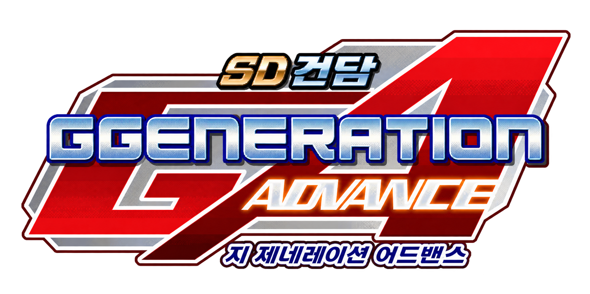

# SD Gundam G Generation Advance 한글패치

> 게임 및 게임 내 이미지에 관한 권리는 각 권리자에게 있습니다. 이 프로젝트는 비공식·비상업 팬 번역 프로젝트입니다.

Game Boy Advance용 **SD Gundam G Generation Advance** 비공식 한국어 패치 프로젝트입니다.

이 저장소는 원본 게임 ROM을 포함하지 않습니다. 배포 파일은 사용자가 **합법적으로 소유한 일본판 원본 ROM**에 적용하는 **xdelta 패치**입니다.

현재 릴리스는 **v1.0.0** 입니다. 원본 16 MiB 일본판 ROM에 적용하면 **32 MiB** 한국어 ROM이 됩니다.

## 가장 빠른 적용 방법

1. **합법적으로 소유한 일본판 원본 `.gba` ROM**을 준비합니다.
2. 원본 ROM의 크기가 **16 MiB (16,777,216 bytes)** 이고 SHA-256이 아래 값과 같은지 확인합니다.
   - `75F362524E1278A77A6F165502F8363A943C8D23F69ECF518355AD8702483772`
3. `outputs/dist/ggen_advance_ko_v1.0.0.xdelta`를 받습니다.
4. Delta Patcher 같은 xdelta3 호환 프로그램에서 원본 ROM에 패치를 적용합니다.
5. 결과 ROM은 **32 MiB (33,554,432 bytes)** 가 되어야 합니다.
6. 패치된 ROM의 SHA-256이 아래 값이면 정상입니다.
   - `04447B928EBFC29FF33CD39AEA9907F659DA095279FA8FFCFC523B9ED329183E`

처음 적용하거나 오류가 발생한다면 [`PATCH_GUIDE.md`](PATCH_GUIDE.md)를 확인해 주세요.

## 현재 배포 파일

- `outputs/dist/ggen_advance_ko_v1.0.0.xdelta` — **v1.0.0** 실제 배포용 패치
- `outputs/dist/ggen_advance_ko_v1.0.0_xdelta.json` — 버전/원본/출력/xdelta 해시와 빌드 정보
- `outputs/dist/ggen_advance_ko_v1.0.0_XDELTA_README.md` — 자동 생성된 xdelta 기술 정보
- `outputs/dist/SHA256SUMS_v1.0.0.txt` — 확인용 SHA-256 목록
- [`RELEASE_NOTES_v1.0.0.md`](RELEASE_NOTES_v1.0.0.md) — 첫 공개 릴리스 요약

현재 xdelta 자체의 SHA-256:

`92217BA98120A1F2C679FF19F7E2B570E68BFDB417A359D0DEF15A8F5265576F`

xdelta 생성 후 원본 ROM에 다시 적용하여 **현재 메인 TIP과 byte-exact로 동일한 결과가 나오는 것까지 검증**했습니다. 현재 배포 xdelta는 xdeltaUI/구버전 xdelta3 호환을 위해 VCDIFF secondary compression(LZMA)과 application header를 사용하지 않습니다.

## 주의사항

- 이미 패치된 ROM에 다시 적용하지 마세요.
- 원본 ROM의 용량이나 해시가 다르면 정상 적용을 보장하지 않습니다.
- 원본 ROM과 세이브 파일은 반드시 별도로 백업해 두세요.
- 이 패치는 ROM을 16 MiB에서 32 MiB로 확장합니다.
- 원본 ROM, 한국어 메인 TIP, 세이브, 세이브스테이트, 에뮬레이터 바이너리는 저장소에 포함되지 않습니다.

## 문제 제보 시 필요한 정보

오류를 발견하면 가능하면 다음 정보를 함께 남겨 주세요.

- 문제가 발생한 장면 또는 스테이지
- 화면 캡처
- 보이는 대사/메뉴 문구
- 사용한 에뮬레이터와 버전
- 재현 절차
- 패치된 ROM의 SHA-256

## 저작권 및 비공식 프로젝트 안내

이 프로젝트는 **비공식·비상업 팬 번역/호환성 연구 프로젝트**이며 게임의 제작사·유통사·플랫폼 권리자와 제휴, 후원 또는 승인 관계가 있음을 주장하지 않습니다. 게임, 등장인물, 기체, 명칭, 상표 및 원저작물에 관한 권리는 각 권리자에게 있습니다.

공개 배포에는 원본 ROM이나 패치 완료 ROM을 포함하지 않으며, 사용자가 **합법적으로 소유한 일본판 원본 ROM**에 적용하는 xdelta 차이 패치만 제공합니다. 다만 **xdelta 형식이라는 이유만으로 모든 저작권 문제가 자동으로 해소되거나 적법성이 보장되는 것은 아닙니다.** 원본 ROM 또는 패치 완료 ROM을 재배포하지 마세요.

이 저장소의 코드·문서 등 프로젝트 작성물에 관한 권리와 제3자 게임 콘텐츠에 관한 권리는 서로 별개입니다. 이 저장소는 제3자 게임 자산, 원문, 상표 또는 그 밖의 권리에 대한 라이선스를 부여하지 않습니다. 자세한 공개 범위, 권리자 요청 및 보증 부인은 [`docs/LEGAL_NOTICE.md`](docs/LEGAL_NOTICE.md)를 확인해 주세요.

## 라이선스

프로젝트가 자체 작성하고 라이선스를 부여할 권한이 있는 코드·도구·문서 등은 [`LICENSE`](LICENSE)의 **MIT License**로 공개합니다. MIT License는 원 게임이나 제3자 게임 콘텐츠에 대한 이용허락으로 확장되지 않습니다.

한글 글리프에는 Lee Minseo의 **Galmuri** 폰트가 사용되며, 폰트 소프트웨어는 **SIL Open Font License 1.1**을 따릅니다. 폰트 바이너리는 공개 저장소에 포함하지 않습니다. OFL 원문은 [`docs/GALMURI_OFL.txt`](docs/GALMURI_OFL.txt)를 참고하세요.

라이선스 적용 범위와 제3자 권리의 구분은 [`NOTICE.md`](NOTICE.md)를 반드시 함께 확인해 주세요. 특히 `data/`와 `integrated/translation/`의 번역/검증 데이터에 원 게임의 짧은 원문이나 식별자가 포함되어 있더라도, 그 제3자 원저작물 자체에 MIT License가 부여되는 것은 아닙니다.

"# GBA-GGNA-KOR" 
